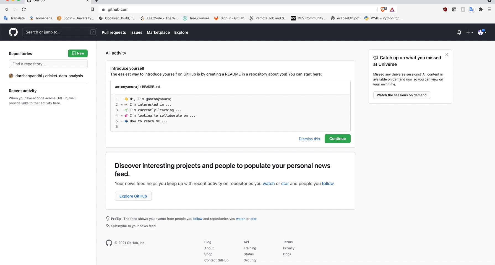
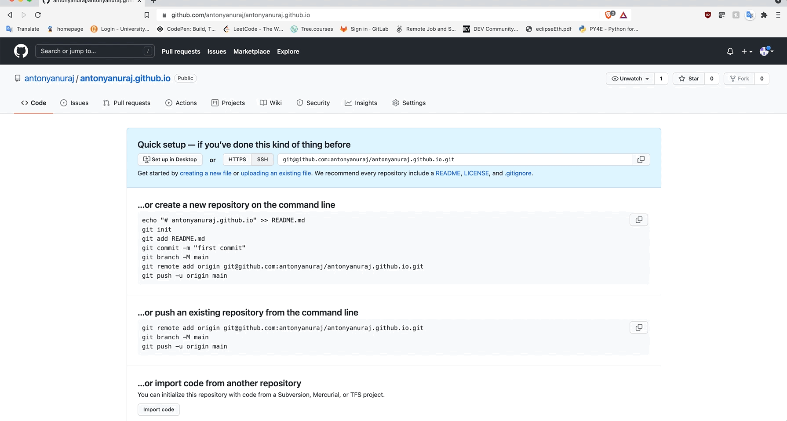
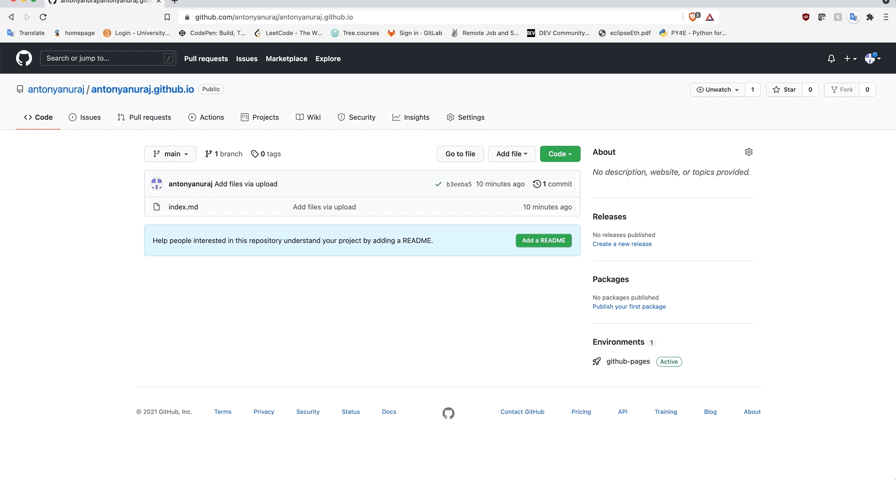

# How to host a resume on GitHub Pages  

## Purpose  

The purpose of this README is to provide a step-by-step guide on how to host a resume on GitHub Pages and relate it to the principles found in Andrew Etter’s book [Modern Technical Writing](https://www.amazon.ca/Modern-Technical-Writing-Introduction-Documentation-ebook/dp/B01A2QL9SS).  

## Prerequisites  

To get started you will need a few things:  

1) GitHub Account  
    - Create an account on [Github](https://github.com), you will need to provide an email address, username and password.  

2) Markdown Editor 

    - You can use any markdown editor to create a resume. I personally used [Visual Studio Code](https://code.visualstudio.com/).  

3) Resume  

    - The resume has to be in Markdown format. If you are not familiar with  the syntax of Markdown or need a refresher, please refer to the [Markdown Tutorial](https://www.markdowntutorial.com/).  

## Instructions  

### 1) Create a new GitHub Repository  

**Using Distributed Version Control Systems (DVCS) is more beneficial than using centralized sytems. Some of the benefits include better performance and allow users to work offline. Ability to work concurrently on the same file is what wins it for DVCS. The repository allows multiple people to contribute to it which brings benefits such as ability to peer review a person's work.**

   - Login to the GitHub Account.  

   - Click `+` button on the top right corner.  

   - Select `New repository` from the menu.  

   - Set `Owner` to `your Username` if not already selected.  

   - Enter repository name as `yourUsername.github.io`.  

   - Set who can see your repository by selecting either `Public` or `Private`.  

   - Click `Create repository` to confirm your preferences and create the repository.     

  

__By using your username as the repository name, it lets GitHub know that this repository will be using GitHub Pages.__  

### 2) Upload resume file  

**Using version control for documentation can be seen sometimes as doing a bit to much. Moreover, using it for documentation purposes helps a technical writer positively because it allows them to collaborate with developers. Using modern technologies help to display effort of a person. As time passes technology changes, and if a person puts in effort to keep up, it is not something others would take lightly.**

   - Rename your resume which is in `.md` format from `currentName.md` to `index.md`.  

   - Click `uploading an existing file` in your GitHub repository.  

   - Click `choose your files`.  

   - Select `index.md` (your resume) from your computer.  

   - Click `open` to confirm your selection of files.  

   - Click `commit changes` to upload the file to repository.  

    
  

### 3) Apply Jekyll theme to your website  

**Jekyll is a static website generator. It is able to generate beautiful websites with just content (in lightweight markup language) and a theme. Andrew Etter suggests that using a theme and spending time customizing your website helps your website stand out from thousands of plain and unappealing looking websites.**

   - Go to the `settings` in your repository.  

   - Scroll down till you see a section called `GitHub Pages`.  

   - Click the link `Check it out here!` to display the GitHub Pages section.  

   - Click button `Choose a theme`.

   - Select the theme you want to apply to your website.  

   - Click `Select theme` to apply the theme to your website, a `_config.yml` is automatically created for you in your repository.  

  

### 4) Customizing Jekyll theme applied to Website  

**Making changes to the website is as simple as making changes to the content. Jekyll will process everything again and display the website with the new changes in content. This type of flexibility is what makes Jekyll one of the most popular static site generator.**

- Open file called `_config.yml`.  

- Edit the file by adding a new line of code `title: YourName`.  

- Commit the new changes to the file.  

### 5) Access the hosted resume  

- Enter `yourUsername.github.io` in your browser to access your hosted resume.  

**Creating and distributing files as PDF can lead to multiple out-of-date documentation being stored in different places. Using a lightweight markup format file to store documentation online will allow the host to just change the content of the file to keep the document up-to-date.**

  

**Well Done you have successfully hosted your resume on GitHub Pages!**  

## More Resources  

- [Markdown tutorial](https://www.markdowntutorial.com/)  

- Andrew Etter’s book [Modern Technical Writing](https://www.amazon.ca/Modern-Technical-Writing-Introduction-Documentation-ebook/dp/B01A2QL9SS)  

- [Cayman](https://github.com/pages-themes/cayman) Jekyll theme.  

- Learn more about [Jekyll](https://jekyllrb.com/)  

## Authors and Acknowledgments  

This guide was written by [Antony Anuraj](https://github.com/antonyanuraj)  

Special thanks to my group members: Raman Bhandari, Jason Tran, and Shawn Lanting, for peer-reviewing my resume and guide.

## FAQs  

### Why is Markdown better than a word processor?  

    According to Andrew Etter, "Microsoft Word is a wonderful choice for creating résumés and a horrible choice for creating documentation."  

    Source: Etter, Andrew. Modern Technical Writing (p. 16).  

- Appilications like Microsoft Word are only avaliable for Mac and Windows users and also requires users to purchase a license to use it. Markdown is a free, lightweight markup language that people can learn in a few minutes to create any documentation.  

### Can I use a custom domain for my Github site?  

  - Yes, click [here](https://docs.github.com/en/pages/configuring-a-custom-domain-for-your-github-pages-site/about-custom-domains-and-github-pages) to learn about how to use a custom domain.  